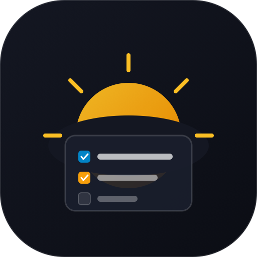

# DayCraft · Daily Routine & Timetable Planner

<p align="center">
  
</p>

<p align="center">
  <strong>A calm, modular routine composer tailored to how you live.</strong><br>
  Build your ideal day by combining tailored routines for Morning, Afternoon, Evening, and Bedtime.
</p>

<p align="center">
  
  
  
  
  
  
</p>

---

## 🌿 Philosophy: Not a Habit Tracker

DayCraft is built around an intentional, burnout-free principle:

> **Users build their day by combining different routine types for Morning (🌅), Afternoon (☀️), Evening (🌆), and Bedtime (🌙).**

- ❌ **No streaks, XP, habit scores, or leaderboards.**
- ❌ **No shame for missed days or rigid check-ins.**
- ✅ **A peaceful, practical daily checklist** designed around real-life rhythms and changing schedules.

---

## 📱 App Showcase

<p align="center">
  
  
  
  
</p>

---

## ✨ Core Features

### 1. 🌅 Four Chronological Daily Blocks
- **Morning (6:00 AM – 12:00 PM)**
- **Afternoon (12:00 PM – 5:00 PM)**
- **Evening (5:00 PM – 9:30 PM)**
- **Bedtime (9:30 PM – Sleep)**

### 2. 🏛️ Lifestyle Blueprints
Choose a lifestyle blueprint upon onboarding or switch anytime via Settings:
- **🏛️ Govt Exam Aspirant (100% Full-Time Self-Study)**: High-yield syllabus coverage, newspaper analysis, GS slots, CSAT, optional revision, and timed mock tests.
- **💼 Corporate Worker & Professional**: Commute prep, WFH deep work focus, cross-functional syncs, post-work gym, and executive wind-downs.
- **🎓 College & School Student**: Lecture prep, lab sessions, assignment sprints, library research, and student rest.
- **✨ General Lifestyle**: Mindful fresh start, midday flow, evening relaxation, and healthy sleep reset.

> **Blueprint Isolation**: Selecting a blueprint activates only its curated templates. Custom templates created while using a blueprint remain safely preserved under that persona profile.

### 3. 🔄 Independent Block Swapping & One-Off Tasks
- Swap any block for today only with another template, mark it as **Off / Free**, or customize it without altering weekly defaults.
- Add one-off tasks with target time pills and notes directly to today's schedule.

### 4. 📅 Recurring Weekly Schedule
- Map default templates for each day of the week (Monday through Sunday).
- **"Copy to Mon–Fri"** action for quick weekday configuration.

### 5. 🔒 100% Local & Private
- All schedules, templates, and history are stored securely on-device using local persistence.
- Zero server tracking, telemetry, or account requirements.
- Full JSON backup export and restore capabilities.

### 6. 🎨 Theme System
- Native support for **Light Mode**, **Dark Mode**, and **System Auto-detection**.

---

## 📸 Screenshots (Physical Device)

| Screen | Description | Clean Capture |
| :--- | :--- | :---: |
| **Today's Flow** | Daily routine checklist with calm progress bar | [View Screenshot](screenshot%20image/01_today_flow.png) |
| **Routines Library** | Morning, Afternoon, Evening & Bedtime templates | [View Screenshot](screenshot%20image/02_routines_library.png) |
| **Weekly Schedule** | Recurring 7-day timetable planner | [View Screenshot](screenshot%20image/03_weekly_schedule.png) |
| **Lifestyle Blueprints** | Theme selector & lifestyle profiles | [View Screenshot](screenshot%20image/04_lifestyle_blueprints.png) |

---

## 🚀 Getting Started

### Prerequisites
- Node.js 18+
- npm or yarn

### Installation
```bash
# Clone the repository
git clone https://github.com/ravishu5/DayCraft.git
cd DayCraft

# Install dependencies
npm install

# Start Vite dev server
npm run dev
```

### Android Native Build (Capacitor)
```bash
# Build production web bundle
npm run build

# Sync assets to Android project
npx cap sync android

# Build release APK
cd android
./gradlew assembleRelease
```

The signed release APK will be generated at:
```text
DayCraft-release.apk
```

---

## 🛠️ Tech Stack
- **Framework**: [React 19](https://react.dev/) + [TypeScript](https://www.typescriptlang.org/)
- **Build Tool**: [Vite 7](https://vitejs.dev/)
- **Native Mobile**: [Capacitor 7](https://capacitorjs.com/)
- **Icons**: [Lucide React](https://lucide.dev/)
- **Styling**: Vanilla CSS Design Tokens & Glassmorphism

---

## 📄 License
This project is licensed under the MIT License.
